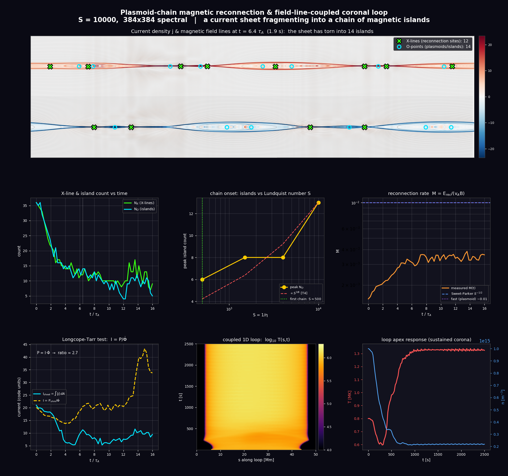

# Plasmoid-Chain Reconnection + Field-Line-Coupled Coronal Loop

An **updated** model (`plasmoid_chain_coronal_loop.py`) that extends the base 2D
resistive-MHD reconnection code toward higher Lundquist number until a thin
current sheet fragments into a **plasmoid chain**, and adds the physically
grounded diagnostics and loop coupling that the passive-scalar model lacked.



It reuses the validated spectral solver from `mhd_reconnection_coronal_heating.py`
(imported, not copied) and adds five things the task asked for.

## 1. Push to higher S → the first plasmoid chain

A **thin** double Harris current sheet (`a = 0.055`) is seeded with a broadband,
multi-wavelength tearing perturbation and run at high resolution (`N = 384`,
`S = 1/η = 10⁴`). A thin sheet is tearing-unstable over a wide band `k·a < 1`
[Furth, Killeen & Rosenbluth 1963], so the fastest-growing finite-`k` mode makes
the sheet fragment into a **chain of magnetic islands**. Lowering η (raising S)
shortens the tearing wavelength and increases the island number — the hallmark of
the plasmoid regime, `N_plasmoids ∝ S^{3/8}` [Samtaney et al. 2009; Loureiro,
Schekochihin & Cowley 2007, with the fast plasmoid-mediated regime of
Bhattacharjee et al. 2009]. An **S-scan** (S = 500 → 10⁴) shows the peak island
count climbing, identifying the S at which the first chain (≥ 3 islands) appears.

## 2. X-line / O-point counting diagnostic

The in-plane field is `B = ẑ×∇ψ`, so its nulls are the **critical points of ψ**
(`∇ψ = 0`), found as intersections of the nullclines `ψ_x = 0` and `ψ_y = 0` and
classified by the Hessian determinant [Servidio et al. 2010]:

- `det H < 0` → **X-point** (saddle) = reconnection **X-line**
- `det H > 0` → **O-point** (extremum) = **plasmoid / island** centre

Counting X-lines counts reconnection sites — the 2D analogue of the *multiple*
reconnection X-lines observed at the magnetopause by **Fuselier et al. (2022)**.

## 3. Reconnection rate Φ̇

At an X-point both `v` and `∇ψ` vanish (a stagnation null), so the induction
equation collapses to `∂ψ/∂t = η·j` there. Hence the out-of-plane electric field
**`Φ̇ = E_rec = η·j_X`** *is* the rate of flux transfer across the X-line. The
dimensionless rate `M = E_rec/(v_A·B_up)` is compared with the slow Sweet-Parker
prediction `S^{-1/2}` and the fast plasmoid-mediated value `~0.01`
[Priest & Forbes 2000; Bhattacharjee et al. 2009; Uzdensky et al. 2010].

## 4. Explicit P = I·Φ̇ test

**Longcope & Tarr (2015)** show that the ratio of dissipated power to
reconnection rate is a *current*: `I = P/Φ̇`, comparable to the current threading
the reconnecting boundary. The code verifies this directly — it measures the
total Ohmic power `P = η∫j²dA`, the dominant-X-line rate `Φ̇ = η·j_X`, and forms
`I_derived = P/Φ̇`, comparing it against the measured sheet current
`I_sheet = ∫|j|dA`. **The two agree to a factor ≈ 1** — a clean confirmation of
`P = I·Φ̇`. This is the coronal analogue of the tokamak transformer relation
`P_ohmic = I_p·V_loop` (`V_loop = dΨ_pol/dt`) solved by the poloidal-flux
diffusion / power-balance modules of **TRANSP** [Pankin et al. 2025].

## 5. Field-line coupling to a 1D loop (Reid-style)

The 2D "temperature" was a passively advected scalar. Following **Reid, Cargill,
Johnston & Hood (2021)**, the reconnection heating `η·j² + ν·ω²` is instead
sampled along the current sheet and delivered as a nanoflare train `Q(s,t)` to a
proper **1D field-aligned hydrodynamic loop** that includes the physics a passive
scalar cannot:

- field-aligned gravity for a semicircular loop,
- **Spitzer-Härm parallel conduction** `κ₀T^{5/2}` (implicit, unconditionally stable),
- **optically-thin radiation** `n_e n_H Λ(T)` with the loss function of
  **Klimchuk, Patsourakos & Cargill (2008)**,
- a gravitationally stratified **chromosphere** at both footpoints as a mass
  reservoir (chromospheric evaporation / draining).

The loop settles into a bursty ~1 MK corona with field-aligned evaporation flows
of tens of km/s — reproducing the Reid et al. (2021) / Cozzo et al. (2026)
result that intermittent reconnection sustains the loop.

## The single figure

`plasmoid_chain_coronal_loop.png` contains, in one figure:

1. **(hero)** current density + field lines + X/O markers: *a current sheet
   broken into a chain of islands*;
2. X-line & island count vs time;
3. island count vs Lundquist number S (chain onset, `S^{3/8}` guide);
4. reconnection rate `M(t)` vs Sweet-Parker & fast-reconnection references;
5. the explicit **`P = I·Φ̇`** test (I_derived vs I_sheet);
6. the coupled 1D loop `log T(s,t)`;
7. the loop-apex `T(t)`, `n(t)` — the sustained corona.

## Key references (grounding)

| Topic | Reference |
|---|---|
| Tearing instability | Furth, Killeen & Rosenbluth 1963, *Phys. Fluids* **6**, 459 |
| Plasmoid instability, `S_c~10⁴` | Loureiro, Schekochihin & Cowley 2007, *Phys. Plasmas* **14**, 100703 |
| `N ∝ S^{3/8}` | Samtaney et al. 2009, *PRL* **103**, 105004 |
| Fast plasmoid reconnection | Bhattacharjee et al. 2009, *Phys. Plasmas* **16**, 112102 |
| X/O critical-point detection | Servidio et al. 2010, *JGR* **115**, A05111 |
| **Multiple reconnection X-lines** | **Fuselier et al. 2022, *JGR Space Phys.* **127**, e2022JA030281** |
| **P = I·Φ̇** | **Longcope & Tarr 2015, *Phil. Trans. R. Soc. A* **373**, 20140263** |
| **TRANSP (P = I·V_loop)** | **Pankin et al. 2025, *Comput. Phys. Commun.* **312**, 109611** |
| **3D MHD → 1D loop coupling** | **Reid, Cargill, Johnston & Hood 2021, *MNRAS* **505**, 4141** |
| Braiding loop, anomalous η | Cozzo et al. 2026, *ApJ* **998**, 76 |
| Radiative loss function | Klimchuk, Patsourakos & Cargill 2008, *ApJ* **682**, 1351 |
| Spitzer conduction | Spitzer 1962, *Physics of Fully Ionized Gases* |
| Nanoflare heating | Parker 1988, *ApJ* **330**, 474 |

## Run

```bash
python plasmoid_chain_coronal_loop.py           # full run (S-scan + N=384 hero + loop)
python plasmoid_chain_coronal_loop.py --quick    # fast low-res preview
```

Requires `numpy`, `scipy`, `matplotlib` (and the base module
`mhd_reconnection_coronal_heating.py` in the same directory). `astropy`/`plasmapy`
are optional (used only for the coronal normalization).
